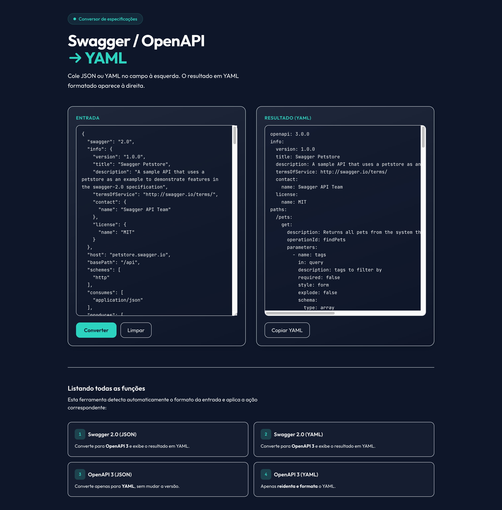

# Swagger / OpenAPI → YAML

Aplicação web para colar especificações em **Swagger 2.0** ou **OpenAPI 3** (JSON ou YAML) e obter o resultado em **YAML** formatado. Converte Swagger 2.0 para OpenAPI 3 quando necessário.

---

## Captura de tela




---

## O que faz

- **Swagger 2.0 (JSON)** → converte para OpenAPI 3 e exibe em YAML  
- **Swagger 2.0 (YAML)** → converte para OpenAPI 3 e exibe em YAML  
- **OpenAPI 3 (JSON)** → converte apenas para YAML  
- **OpenAPI 3 (YAML)** → apenas reidenta e formata o YAML  

A ferramenta detecta automaticamente o formato da entrada e aplica a ação correspondente.

---

## Como rodar

### Com Node.js (local)

Requisitos: **Node.js 18+**

```bash
git clone <url-do-repositorio>
cd swagger-convert
npm install
npm start
```

Acesse [http://localhost:3000](http://localhost:3000).

### Com Docker (local)

```bash
docker build -t swagger-convert .
docker run -p 3000:3000 swagger-convert
```

Acesse [http://localhost:3000](http://localhost:3000).

### Imagem publicada no GitHub (GHCR)

Após o push na branch `main` ou `master`, a pipeline publica a imagem no **GitHub Container Registry**. Para usar:

```bash
docker run -p 3000:3000 ghcr.io/SEU-USUARIO/swagger-convert:latest
```

Substitua `SEU-USUARIO` pelo dono do repositório (por exemplo, `ghcr.io/fulano/swagger-convert:latest`).

---

## Pipeline (GitHub Actions)

O repositório inclui um workflow que:

1. **Disparo:** a cada push em `main` ou `master`, ou manualmente em *Actions → Build and Publish → Run workflow*.
2. **Compilação:** gera a imagem Docker a partir do `Dockerfile`.
3. **Publicação:** envia a imagem para o **GitHub Container Registry** (`ghcr.io`).

- **Tags geradas:** `latest` (branch padrão) e tag com o SHA do commit.
- **Permissões:** usa o `GITHUB_TOKEN` do próprio repositório; em repositórios públicos não é necessário configurar segredos adicionais.

Para deixar o pacote público no GHCR: no repositório, vá em *Packages* → selecione o pacote → *Package settings* → *Change visibility* → **Public**.

---

## Uso na interface

1. Cole o JSON ou YAML no campo **Entrada** (à esquerda).
2. Clique em **Converter**.
3. O resultado em YAML aparece no painel **Resultado (YAML)** à direita.
4. Use **Copiar YAML** para colar em outro lugar e **Limpar** para zerar os campos.

---

## Stack

| Tecnologia        | Uso                                  |
|-------------------|--------------------------------------|
| **Node.js**       | Runtime                              |
| **Express**       | Servidor HTTP                        |
| **swagger2openapi** | Conversão Swagger 2.0 → OpenAPI 3 |
| **js-yaml**       | Leitura/escrita de YAML              |
| **Tailwind CSS**  | Interface (via CDN)                   |

---

## Estrutura do projeto

```
swagger-convert/
├── .github/workflows/
│   └── build-publish.yml   # Pipeline de build e publicação no GHCR
├── docs/
│   └── screenshot.png      # Print da tela (adicionar aqui)
├── public/
│   └── index.html         # Página da aplicação
├── Dockerfile
├── package.json
├── server.js
└── README.md
```

---

## Licença

MIT

